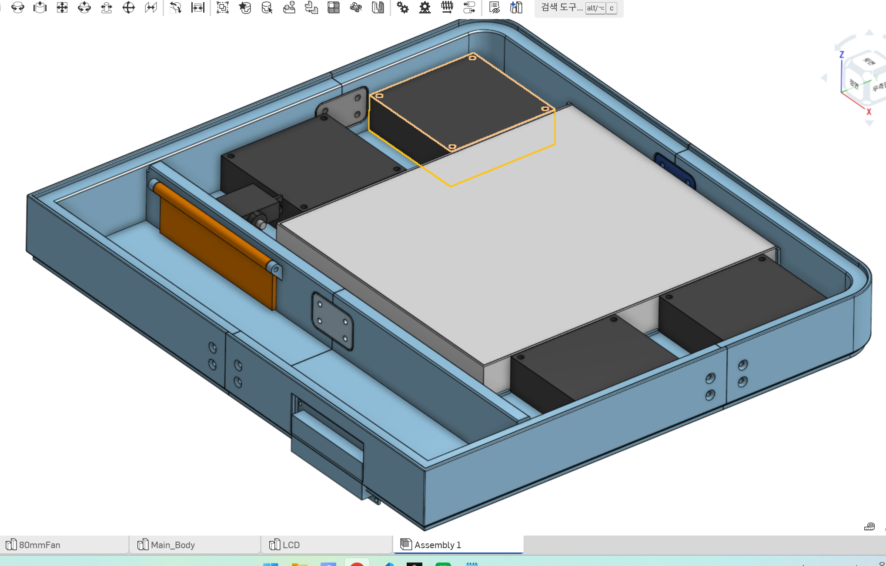

Even when I run ventilation and an air purifier together, gases and fine particles from indoor printing still keep bothering me.

Recently I have been running 24-hour prints more often, so I felt I needed to solve this problem properly.

There are options like a chamber or purifier-only setup, but space is limited and replacing filters continuously is also a burden.

So I decided to proceed with an automotive cabin filter-based approach that can use parts I already have and still gives good cost-performance.

Also, when printing PETG on the X1C with the door closed, internal heat often softens the filament and causes print failures.
If I open the door that issue is reduced, but shrinkage increases and air filter effectiveness drops.

After adding an X2D and using it, I liked how its active ventilation keeps internal temperature in a better range, so I want to add a similar function to this system.
   

- A top-mounted fan would be nice, but it makes vertical volume too large, so I placed it on the side.
- The main fan is mounted in the exhaust direction, and the filter-fan section is set up to become negative pressure.
- A servo-driven door opens when internal temperature rises, bringing in outside air and lowering the internal temperature.

 
 
 

There are many modern MCUs and displays, but I plan to use older parts as much as possible, mainly to consume existing stock, including an Arduino Uno and a 1602 LCD.
