# Various Project Updates

I have several projects going on at once, so things are a bit chaotic, but these are the ones I have been focusing on most recently.

## Music Box Puncher

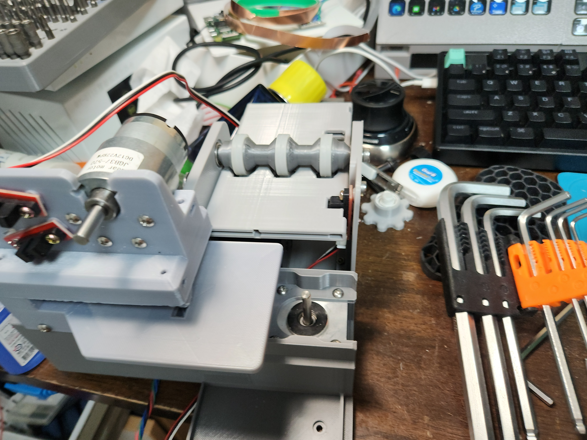

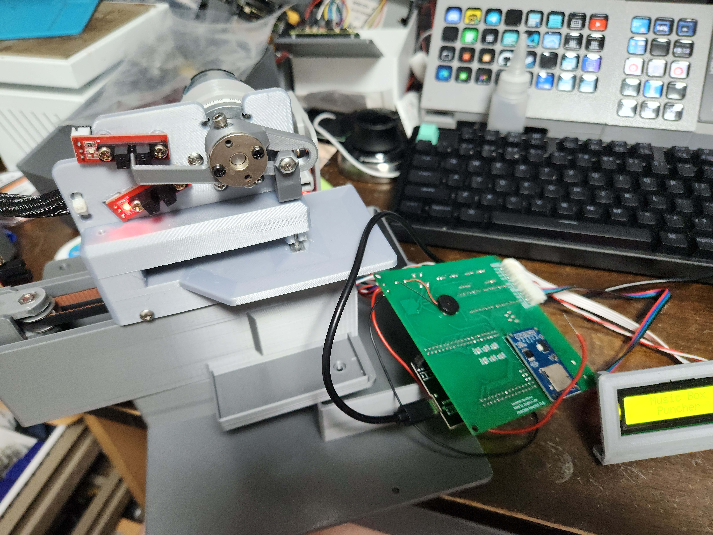

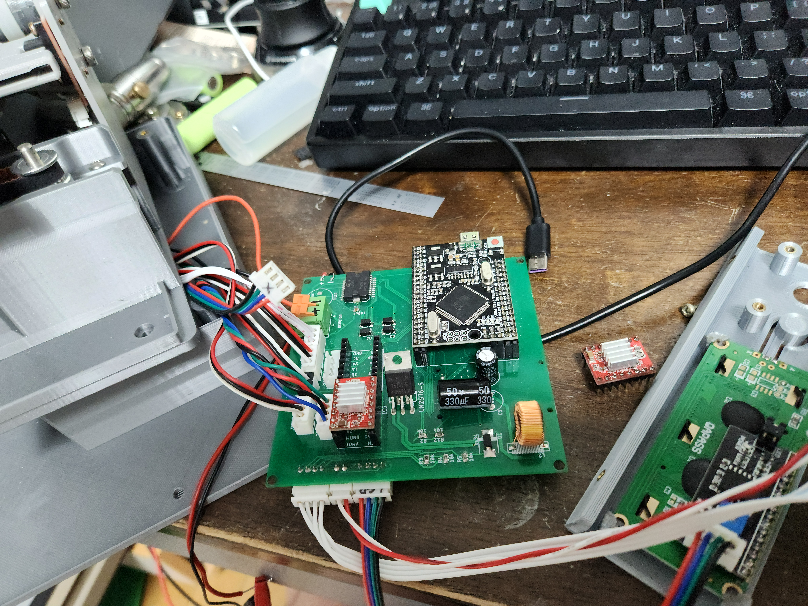

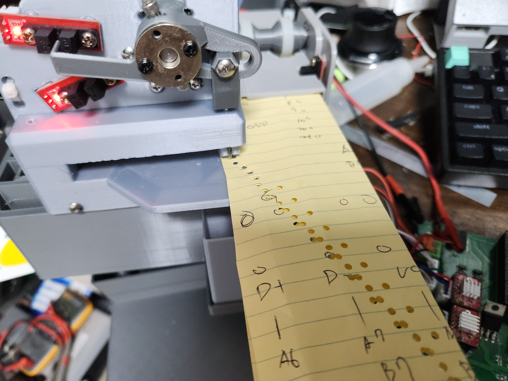

This is something I am making again after a very long time.
I think it originally started around seven years ago.

I plan to keep the remaining parts only for after-sales service and wrap up this version.

I do not know whether I will make a new upgraded version later,
but I do want to upgrade it at some point.

## FOC Driver Experiments

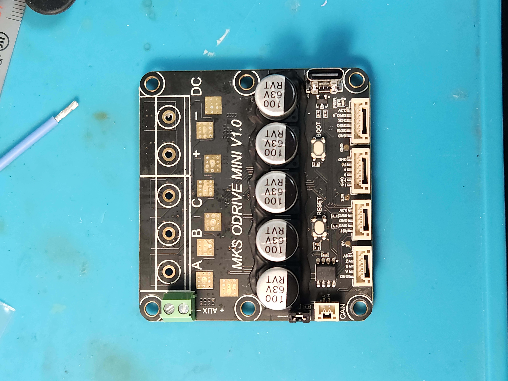

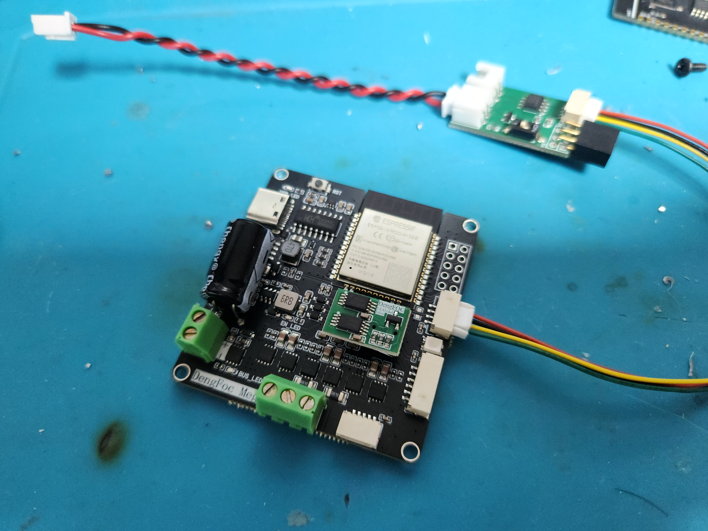

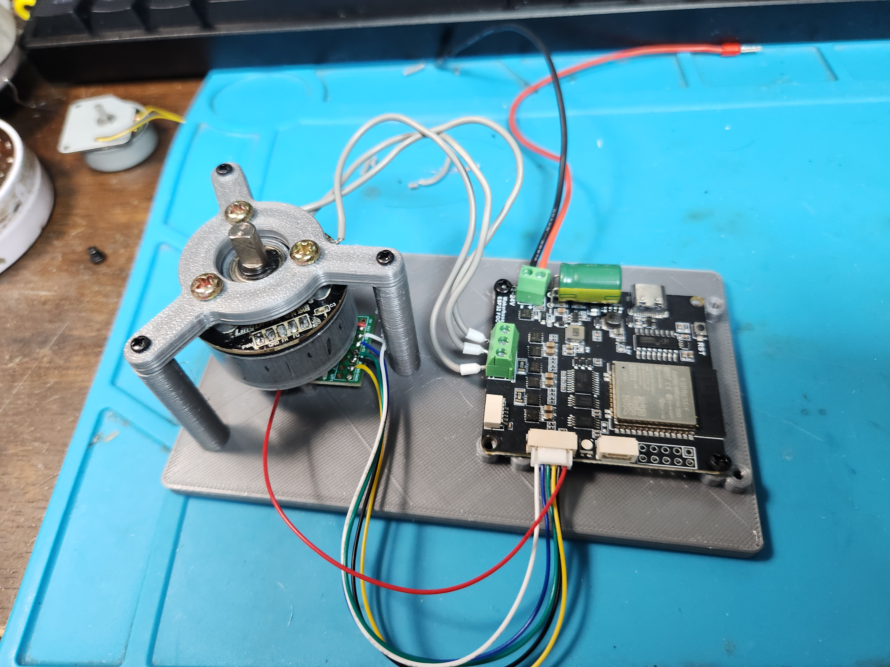

I started this project after seeing ETH Zurich's Cubli project and wanting to try something similar.

<https://www.youtube.com/watch?v=n_6p-1J551Y>

RemRC's YouTube version is also well known,
and the Arduino version is easier to build,
but the code was hard for me to follow,
and tuning the earlier version was not easy.

After leaving it alone for a while,
I came back and started over from the hardware side.

But choosing and testing the driver also was not easy.

I wanted to use a magnetic angle sensor and an FOC driver for more precise control,
but there were too many options,
so I had to buy several and test them directly before deciding.

Odrive is powerful and has strong performance,
but it felt like too much for what I wanted.

Among the SimpleFOC options,
I found an ESP32-based driver that supports single-axis control,
CAN communication,
and some spare pins.

The problem was that it did not run at all.

When I contacted the seller,
they said they also had no documentation
and only offered to connect me with an engineer through QQ,
which was not practical for me.

Eventually I decided to investigate it myself,
and luckily MKS had a schematic on GitHub.

The problem was very simple.
The enable pin number was different.

After that I tested a few motors as well.

If possible I wanted to use a cheap massage-gun BLDC motor from AliExpress,
but the response was slow and the maximum RPM was too low,
so I decided to use a drone BLDC motor instead.

Next I plan to test CAN communication and single-axis control.

## Curta Calculator Build

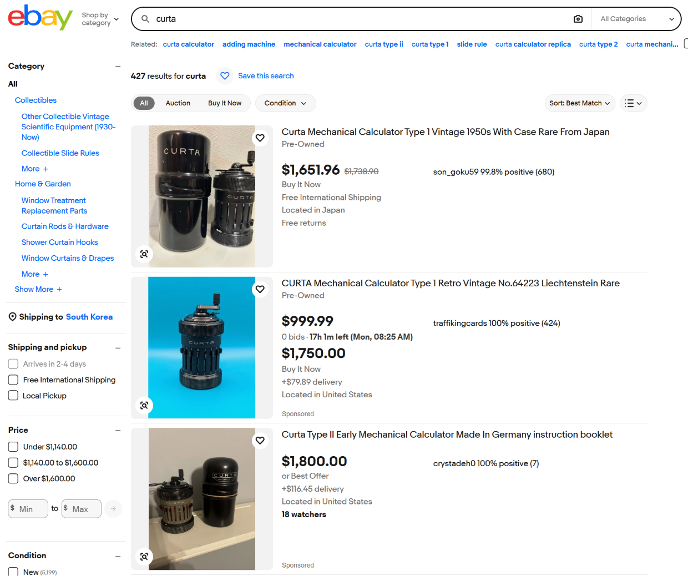

Curta is a mechanical calculator from Austria.

It is something I have wanted for a long time.
I probably could buy one if I really pushed myself,
but I do not have the kind of budget to spend several million won on a collectible item,
so it stayed in the category of things I only looked at.

I used to check 3D printable designs for it once in a while,
but I had not seen anything very usable before.

Recently I looked again,
and this time I found a model that looks pretty promising.

<https://makerworld.com/models/753910-kotta-calculator-type-i>

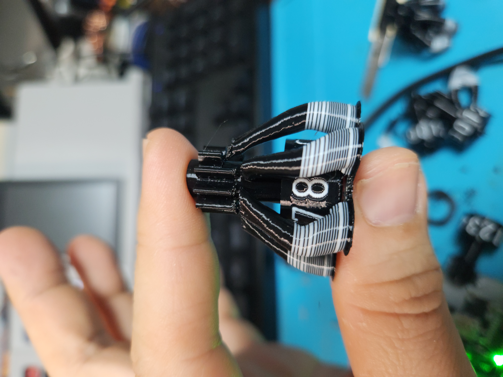

After printing a few parts,
it looks like AMS and support filament are almost required.

For now,
I am just printing parts little by little whenever I have time.

## 1D Arcade Game

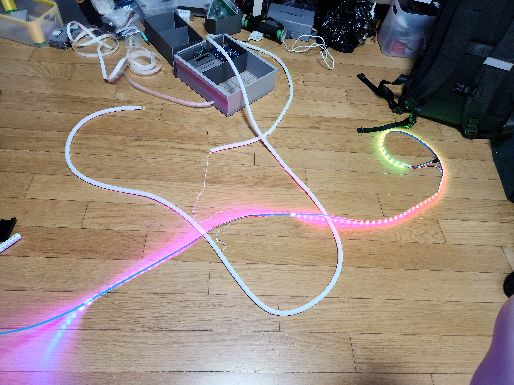

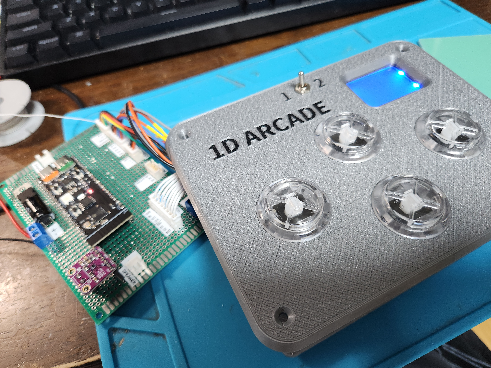

<https://www.youtube.com/shorts/o-0I9kOMT_s>

This is another thing I had planned to make a long time ago,
and then left sitting around after only buying the RGB LED strip.

Since I applied to join Maker Faire,
I am finally pushing it forward properly.

Development is moving very quickly because I am letting AI handle most of the coding.

Synchronizing sound output with gameplay may be a bit tricky,
and I do not think I should leave polishing the game logic entirely to AI.
